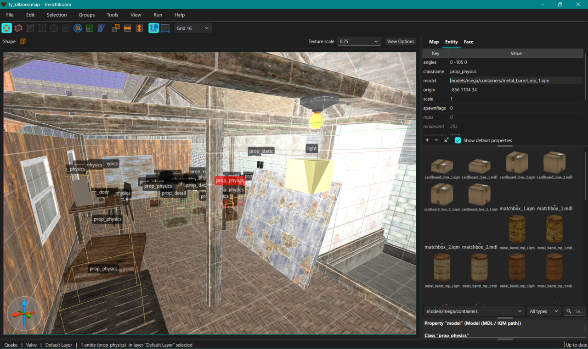
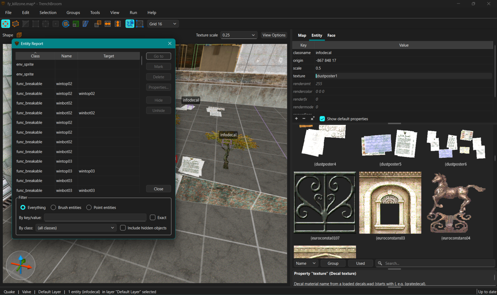
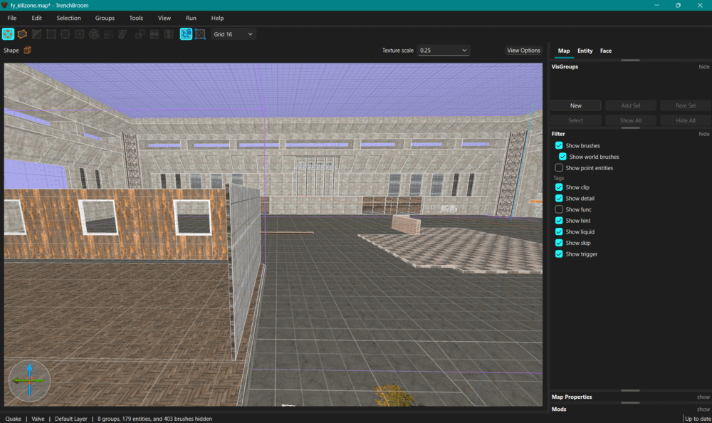
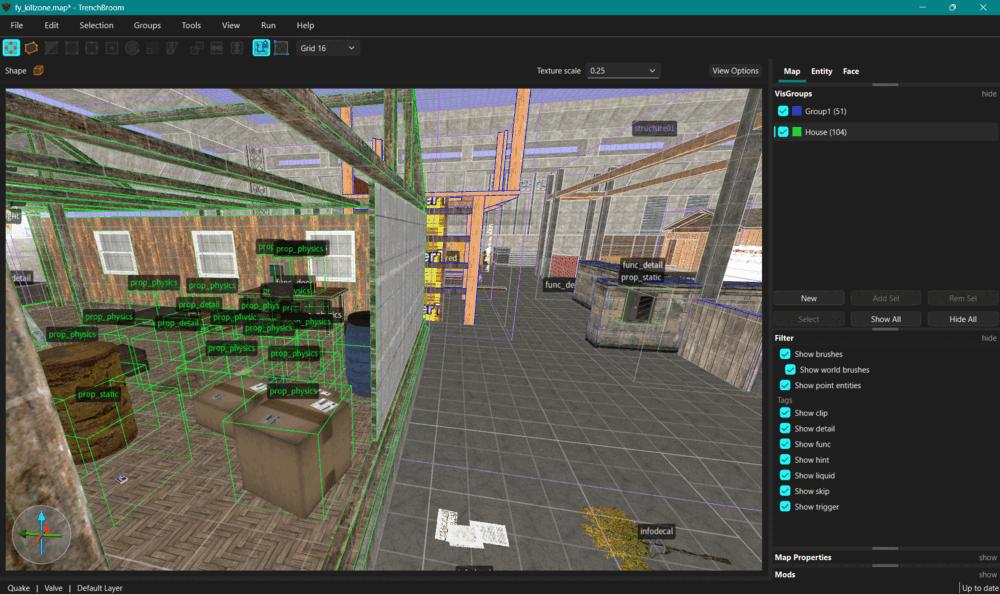

# slopbroom

**slopbroom** is an AI-built fork of [TrenchBroom](https://github.com/TrenchBroom/TrenchBroom),
the level editor for Quake-engine games — effectively every change was written by an AI coding
assistant (hence the affectionate name), directed by the repository owner. It adds editor
features for an FTEQW-based CS/CoD-style mod.

> *Pick a prop's model from a live thumbnail grid — folder dropdown, file-type filter, and an
> in-viewport preview.*

## What it adds

- **Visual model / sprite picker** — browse `models/` and `sprites/` as a thumbnail grid for any
  `prop_*` or `env_sprite`, with a folder dropdown and file-type filter.
- **Material-decal picker** — browse loose `gfx/decals` PNGs and place infodecals, rendered in the
  viewport at their true in-engine size.
- Hammer-style **VisGroups** — multi-membership visibility groups.
- **View filters** — show/hide brushes, point entities, and tags (clip, detail, trigger, …) live.
- Hammer **`.vmf` / `.jmf` import**.
- **Entity Report** — a sortable, filterable table of every entity in the map.
- **Default texture scale** preference + a Draw-Shape tool-bar control.
- Editor-render fidelity: IQM forward-axis fix, GoldSrc studiomodel crash guard, image-sprite
  **alpha blending** + Half-Life/Source **`rendermode`** (additive / glow / colour / alpha),
  and `light` boxes tinted by their own colour.

## In action

**Entity Report** — every entity in the map, sortable and filterable:

**View filters** — toggle brushes, entities, and tags to declutter the viewport:

**VisGroups** — Hammer-style multi-membership visibility groups:

## Building & license

Built with the same toolchain as upstream (CMake + Ninja + Qt 6); see the
[upstream build docs](https://github.com/TrenchBroom/TrenchBroom#trenchbroom). Windows helper
scripts `tb_build.bat` / `tb_rebuild.bat` are included.

slopbroom tracks upstream TrenchBroom and stays licensed under the **GNU GPL v3**
(see [LICENSE.txt](LICENSE.txt)); all upstream copyright notices are preserved, and upstream
history is kept in git (and as the `upstream` remote).

> A personal, AI-built fork ("slop" — but it works well). Not affiliated with or endorsed by
> upstream TrenchBroom; please file issues here, not upstream.
